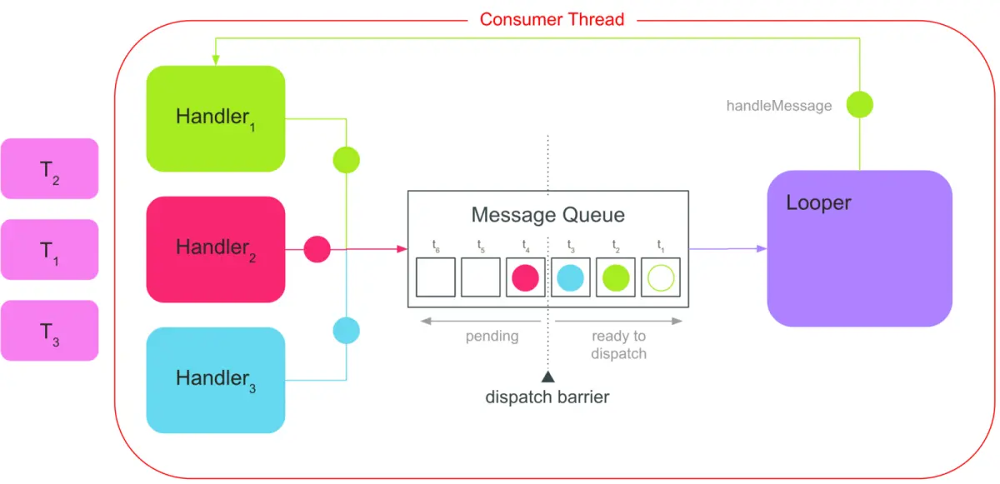

# Android

> 一个有趣的操作系统

activity 就是掌握生命周期

fragment 和activity生命周期的区别和联系，怎么添加fragment，fragment和activity通信

service 也是在生命周期是做事情，activity绑定service进行通信，IntentService异步可自动退出的服务

broadcastRecevier


## AsyncTask 异步

这个早被弃用了，感觉这个东西太简单，方便，所以会有一些漏洞。现在多用java的并发包工具和Handler


## Android Handler 机制

> 它的存在就是因为Android中主线程才能更新UI，主线程不能执行耗时操作，所以得要用子线程

首先得了解异步消息处理机制：由Message、MessageQueue、Looper、Handler四部分组成；执行流程就是创建一个message对象，Handler将这个message放到MessageQueue中，然后Looper发现消息队列中有数据就将数据取出来交给Handler的handleMessage方法处理

```java
override fun onCreate(savedInstanceState: Bundle?) {
        super.onCreate(savedInstanceState)
        binding.fab.setOnClickListener {
            thread {
                val msg = Message()
                msg.what = 1//msg可以携带多种类型数据
                handler.sendMessage(msg)//开启线程将消息发送出去
            }
        }
}
private val handler = object : Handler(Looper.getMainLooper()) {//绑定到主线程和主线程的消息队列
        override fun handleMessage(msg: Message) {//主线程接受消息处理消息
            //super.handleMessage(msg)
            when(msg.what) {
                1 -> print("消息来了...")//就可以在UI线程修改页面处理了
            }
        }
}//可以说主线程的Looper、MessageQueue、Handler吗？可以  多个子线程可以对应多个Handler，向里面发送消息
```

由上面就知道Handler用于进程中线程间的通信，而Android中进程间通信用的是Binder

- Message 专门给Handler处理的消息或Runnable对象，既可以存储简单数据也可以存储复杂类型数据，单链表数据结构，MessageQueue用链表结构实现队列

  ```java
  int what;int arg1;Object obj;Bundle data;//里面有这些字段
  private static final int MAX_POOL_SIZE = 50;//消息最大为50
  ```

  消息池 sPool Message里面用sPool指向单链表顶部来实现栈，它的作用是消息使用后会被回收在这，这部分消息是为了重复利用，并且采用了享元模式避免重复消息对象；创建Message的首选是调用Message.obtain()，源码里面推荐的，本来也是这个道理。

  

  ```java
  public long when;//这个可以在传递消息时设置，MessageQueue中Message的顺序就看这个值的大小 测试时使用
  Handler target;//保存处理当前消息的Handler
  int flags;//消息的状态标记 0、FLAG_IN_USE、FLAGS_TO_CLEAR_ON_COPY_FROM、FLAG_ASYNCHRONOUS
  
  public Messenger replyTo;
  //可选的Messenger，可以发送此消息的回复。具体如何使用的语义取决于发送方和接收方
  ```

- Looper  用于为线程运行消息循环，提供线程上下文环境，创建与线程绑定；创建管理MessageQueue；消费者模式(没消息就阻塞等待)的Looper在MessageQueue中获取消息(只要Looper还在就一直运行，要不跟随应用退出，要不就阻塞)，并叫Handler处理消息；

  **一个Looper只对应一个线程，反之同样**，比如Looper.getMainLooper()就是对应当前主线程，为什么能直接获取，因为Android在系统启动的时候就用ActivityThread.java创建了

  ```java
  /**
  *Returns the application's main looper,which lives in the main thread of the application.
  */
  public static Looper getMainLooper() {
  private Looper(boolean quitAllowed) {
  //Looper的构造函数是私有的，通常都是由静态方法prepare()来创建;上面这个方法也是一样用来创建Looper
  public static void loop() {//这个方法是用来不断从MessageQueue中取消息的
      
  //这是一个源码中实现Looper线程的典型示例，使用prepare和loop的分离来创建一个初始Handler来与Looper通信。
     class LooperThread extends Thread {
         public Handler mHandler;
   
         public void run() {
             Looper.prepare();//初始化当前线程的Looper
   
             mHandler = new Handler(Looper.myLooper()) {
                 public void handleMessage(Message msg) {
                     // process incoming messages here
                 }
             };
   
             Looper.loop();//进入循环消息模式，有Message就将它发送给它内部target引用的Handler
         }
     }
  ```

- Handler 它的子类必须为static，避免内存泄露；用于发送消息、处理消息、移除消息；Looper在哪个线程是由Handler初始化位置决定。

  从它的构造方法可以看出创建Handler就意味着Looper，MessageQueue，Callback，mAsynchronous的创建

  而且源码里面有创建消息的方法，但是直接用Message比较好

  ```java
  public Handler(@NonNull Looper looper, @Nullable Callback callback, boolean async) {
          mLooper = looper;//如果构造函数中没Looper就使用默认Looper
          mQueue = looper.mQueue;//使用looper中创建的MessageQueue
          mCallback = callback;//设置回调接口，默认为null
          mAsynchronous = async;//默认同步
  }
  public final Message obtainMessage() {//就这个，少用
          return Message.obtain(this);
  }
  public final boolean sendMessage(@NonNull Message msg) {
          return sendMessageDelayed(msg, 0);//在当前时间之前的所有挂起消息后，将消息压入消息队列的末尾
  }
  ```

- MessageQueue  前面说过了消息队列是Looper中创建的，这个队列中Message位置是由Message中when值排序的先进先出；

  ```java
  Message next() {//Looper会调用这个来取消息，这里面有个nativePollOnce(ptr, nextPollTimeoutMillis)调用来判断没消息后的阻塞
  
  ```

- HandlerThread创建与销毁  由两个Handler和一个HandlerThread实现后台线程串行执行；有一个循环器的线程。然后可以使用循环程序创建处理程序。注意，就像普通线程一样，start()仍然必须被调用。内部实现机制主要是实现了Looper；它的退出在activity中将引用设置为null就行；

  ```java
  //示例： UI线程的Handler
  Handler mHandler = new Handler(){//这个空构造现在已经被弃用
      @Override
      public void handleMessage(Message msg) {
          super.handleMessage(msg);
          // 处理UI更新
  };
  
  HandlerThread mBackThread = new HandlerThread("mybackthread");
  mBackThread.start();
  // 后台线程的Handler
  Handler mBackHandler = new Handler(mBackThread.getLooper());//初始化在start()之后，为了得到mBackThread的Looper
  
  mBackHandler.post(new Runnable() {//把这个Runnable放到消息队列中，开启一个线程起到多个线程的作用
      @Override
      public void run() {
          // 后台线程执行耗时操作，异步后台任务执行；这个其实和最开始的异步消息处理机制相似，但是这个
          //的比Thread多了个消息循环机制(有自己的Looper)，还更容易管理
          ...
          // mHandler发消息，回到主线程更新UI
          mHandler.sendMessage(msg);
      }
  });//用完及得退出，避免内存泄露，使用quit或quitSafely(清空消息之前把非延迟消息派发出去处理)
  //使用场景：对于非UI线程又想用消息机制时、替换平时的Thread匿名线程使用、I/O操作
  ```
  
  Android中多个线程创建的多个不同的Handler都关联到主线程的Looper，一个Looper对应一个线程和消息队列
  
  

> 项目中Idd就用这个机制来不断发送收集event


## View事件分发机制


LiveData

> 原理就是设计模式中的观察者模式；将任意一种类型数据用LiveData包装起来，这样当数据变化时观察者就会发现，从而立马做出响应

getValue()、setValue()和postValue()方法。

- getValue()用于获取LiveData中包含的数据
- setValue()用于给LiveData设置数据，但是只能在主线程中调用
- postValue()用于在非主线程中给LiveData设置数据

MutableLiveData：可变的     LiveData是不可变的  他们的区别是什么？ 

用MutableLive封装数据然后私有化后，用LiveData来对开放获取_counter示例，但是不能给这个实例赋值，因为counter是LiveData类型的，里面赋值方法只对子类使用，示例和源码如下：

```kotlin
//示例
val counter: LiveData<Int>
     get() = _counter
private val _counter = MutableLiveData<Int>()

//androidx/lifecycle/LiveData.java源码：
@MainThread
    protected void setValue(T value) {
        assertMainThread("setValue");
        mVersion++;
```

