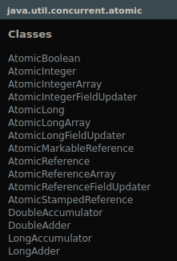
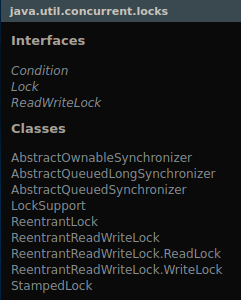
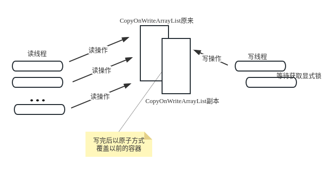

# 并发

### 深入之路

- [并发](#并发)
  - [1. 线程](#1-线程)
    - [1.1 线程创建方式](#11-线程创建方式)
    - [1.2 线程产生问题](#12-线程产生问题)
    - [1.3 线程优点缺点](#13-线程优点缺点)
  - [2. 线程的竞争机制](#2-线程的竞争机制)
    - [2.1 锁的正确理解](#21-锁的正确理解)
    - [2.2 给容器加个锁](#22-给容器加个锁)
    - [2.3 加锁产生问题](#23-加锁产生问题)
  - [3. 线程的协作机制](#3-线程的协作机制)
    - [3.1 协作场景](#31-协作场景)
    - [3.2 wait()/notify()](#32-waitnotify)
    - [3.3 各场景实现](#33-各场景实现)
  - [4. 线程的中断](#4-线程的中断)
  - [5. 并发工具包](#5-并发工具包)
    - [5.1 原子变量和CAS](#51-原子变量和cas)
    - [5.2 显式锁](#52-显式锁)

## 1. 线程

> 首先并发是由线程产生的
>
> 线程状态：创建 -- start就绪 -- 得时间片运行 -- blocked阻塞 -- waiting等待 -- 终止


### 1.1 线程创建方式

```java
 //三种两种创建线程的方式
 //1.继承Thread
 public class HelloThread extends Thread {
     @Override
     public void run() {
         System.out.println("hello");
     }
 }
     public static void main(String[] args) {
         Thread thread = new HelloThread();
         thread.start();//调用start后让操作系统创建线程分配相关资源(单独的程序计数器和栈)以及调度
     }
 }

 //2.实现接口 ，为什么要有这个，就因为单继承的原因，可以说是单继承缺点的解决方式
 public class HelloRunnable implements Runnable {
     @Override
     public void run() {
         System.out.println("hello");
     }
     public static void main(String[] args) {
         Thread helloThread = new Thread(new HelloRunnable());
         System.out.println(helloThread.getPriority());//线程优先级
         helloThread.start();
         thread.join();//让调用join的main线程等待thread线程执行结束
     }
 }
 
/*
线程有一些基本属性和方法，包括id、name、优先级、状态、是否daemo线程、
sleep方法、yield方法、join方法、过时方法等，其实就是Thread类里面的方法，jdk文档很清楚
使用这些方法的技巧就是知道这个方法的作用，以及这个方法是在Object里面，还是Thread的静态方法，
还是Thread的实例方法，知道这些就可以灵活调用了
*/
 
//用FutureTask创建线程执行有返回值
public class CallerTask implements Callable<String> {
    @Override
    public String call() {
        return "hello";
    }
    public static void main(String[] args) throws InterruptedException {
        // 创建异步任务,这个任务会返回结果，不像上面两个似的只会做事情
        FutureTask<String> futureTask  = new FutureTask<>(new CallerTask());
        //启动线程
        new Thread(futureTask).start();
        try {
            //等待任务执行完毕，并返回结果
            String result = futureTask.get();
            System.out.println(result);
        } catch (ExecutionException e) {
            e.printStackTrace();
        }
    }
}

```

### 1.2 线程产生问题

> 线程虽然提高了系统运行效率，但是在处理上面还是有缺点，避免了这两个缺点后线程就完美了

共享内存就是多个线程能访问同一个对象的属性和方法

- 缺点1      竞态条件：就是10000个线程对一个静态变量加1，结果变量值小于10000

​                  解决办法：synchronized、显示锁、原子变量

- 缺点2      内存可见性：一个线程对内存的修改另一个线程看不到；main线程修改了这个变量，但是子线程还是一直运行，并且一直往CPU寄存器或缓存中取放同一个值，就一直看不到不知晓main线程已经修改了

​                  解决办法：volatile关键字、synchronized关键字、显式锁同步

​                  这里加volatile后会发生什么呢？

### 1.3 线程优点缺点

优点就是能充分利用CPU内存磁盘网络资源，在某些业务上使用线程也能优化用户体验，提高应用细节功能

缺点除了上面两个还有就是线程创建，调度，上下文切换都消耗系统资源；操作系统会为线程创建栈和程序计数器，调用和上下文切换会不断恢复删除CPU寄存器中的值，很可能导致缓存值失效。  为甚后面的缺点不放在上面列出，因为这是硬件层面的问题，解决不了，只能预防，反正就是线程这个功能你爱用不用，用就有好处，但是你得解决出现的问题，不用就老老实实地用主线程，少麻烦事做

这里考虑创建线程数量时得考虑时CPU密集型还是IO密集型，因为上个项目里面处理大量数据就只有一个线程处理数据

## 2. 线程的竞争机制

> 线程的竞争机制就是为了解决线程的竞态条件和内存可见性问题

### 2.1 锁的正确理解

synchronized修饰实例方法：一个类中实例方法用这个后，同时只能有一个线程调用这个方法，别的线程调用就得先或得锁，如果获取不了就在等待队列中等待；创建的一个对象里面只要有这个关键字的方法就不能同时执行，但是创建两个对象，两个对象就可以同时执行，两个对象是分开的。 关键字保护的是对象，让每个对象都有一个锁和等待队列。synchronized可以同步任何对象，任何对象都有锁和等待队列。

synchronized修饰静态方法：和上面同理，只是这个锁保护的是类对象

注：如果这个对象中有一个方法没用这个关键字，则另一个线程可以同步使用这个方法，所以在保护变量的时候，需要在所以访问该变量的方法上加synchronized

总结就是synchronized保护实例对象里面有这个关键字的方法或代码块

synchronized修饰代码块其实就是上面两个的意思，一个用synchronized(this)，一个用synchronized(Xxx.class)，也可以随便用对象，synchronized(new Object()),这样就给括号里面的对象加一个锁和等待队列。括号里面就是要保护的对象

```java
 public class Counter {
     private int count;
     public synchronized void incr() {
         count++;
     }
     public synchronized int getCount() {
         return count;
     }
 }
 //上面其实就是下面这个
 public class Counter {
     private int count;
     public void incr() {
         synchronized (this) {
             count++;
         }
     }
     public int getCount() {
         synchronized (this) {
             return count;
         }
     }
 }
 //使用锁对象
 public class Counter {
     private int count;
     private Object lock = new Object();
     public void incr() {
         synchronized (lock) {//去拿Object对象锁
             count++;
         }
     }
     public int getCount() {
         synchronized (lock) {
             return count;
         }
     }
 }
 public class CounterThread extends Thread {//使用
     Counter counter;
     public CounterThread(Counter counter) {
         this.counter = counter;
     }
     @Override
     public void run() {
         for (int i = 0; i < 1000; i++) {
             counter.incr();
         }
     }
     public static void main(String[] args) throws InterruptedException {
         int num = 1000;
         Counter counter = new Counter();
         Thread[] threads = new Thread[num];
         for (int i = 0; i < num; i++) {
             threads[i] = new CounterThread(counter);
             threads[i].start();
         }
         for (int i = 0; i < num; i++) {
             threads[i].join();
         }
         System.out.println(counter.getCount());
     }
 }
```

线程的竞争机制里面的一些问题点

- 可重入性：线程获取对象锁之后可以调用对象中其它被同步的方法
- 内存可见性：synchronized可以实现原子操作，在方法上用关键字，而且还能保证内存可见性，线程获得锁后去内存拿值，释放锁后值写回内存。    用这个实现原子操作成本太高，变量用volatile好，操作系统会给变量加特殊指令

- 同步容器：

### 2.2 给容器加个锁

```java
 - 同步容器：就是实现了collection接口的同步容器类，里面和collection差不多，只是每个方法里面使用了synchronized关键字修饰一个Object对象给容器加锁；但是同步容器会出现问题，比如下面的问题
  
 // 复合操作
     public class EnhancedMap<K, V> {
     Map<K, V> map;
     public EnhancedMap(Map<K, V> map) {
         this.map = Collections.synchronizedMap(map);
     }
     public V putIfAbsent(K key, V value) {
         V old = map.get(key);
         if (old ! = null){
             return old;
         }
         return map.put(key, value);
     }
     public V put(K key, V value) {
         return map.put(key, value);
     }
 //…
 }
 
 //这个类中的map是线程安全的，但是putIfAbsent方法不是；这种一边将map改为同步容器，一边对map操作的复合操作就是有问题的
 
 //伪同步     就是同步错了，就像下面这样，正确的应该同步map对象
 public synchronized V putIfAbsent(K key, V value) {
      V old = map.get(key);
       if (old != null) {
           return old;
        }
       return map.put(key, value);
 }
 //解决伪同步
  public V putIfAbsent(K key, V value) {
         synchronized (map) {
             V old = map.get(key);
             if (old ! = null){
                 return old;
             }
             return map.put(key, value);
         }
     }
 //迭代   就是两个线程对同步容器一个修改，一个遍历；结果就是遍历的会产生异常，因为遍历容器时容器结构发生变化就会抛出异常，解决办法就是在遍历的时候对同步容器加锁
 
 //所以并发容器问题还是挺多的，性能也低，但是Java还有别的性能高的并发容器        有待深入研究
 //CopyOnWriteArrayList
 //ConcurrentHashMap
 //ConcurrentLinkedQueue
 //ConcurrentSkipListSet
```

### 2.3 加锁产生问题

> 死锁：线程相互都持有锁，但还是去获取对方的锁，就会造成死锁

显式锁就是对象的锁带有时间限制，得不到锁就释放，避免死锁		--这个点先放着，后面解决

## 3. 线程的协作机制

> 线程产生的竞态、内存可见性问题用上面竞争机制处理；但是线程也有更厉害的用法

### 3.1 协作场景

- 生产者消费者协作模式 —— 生产者往队列中放数据，消费者往队列中取数据，队列空了后消费者停，队列满了生产者停，这个停就是用wait()/notify()或其他来操作线程实现
- 同时开始 —— 使用某种方式让多个线程一起开始运行
- 等待结束(主从协作) —— 主任务必须等待子任务结束后才能结束
- 异步结果 —— 这个现在有点理解不了，好像跟Future返回结果有关
- 集合点 —— 多个线程都处理到一定程度后在某个地方等待着做一件事，交换数据结果啥的，然后再各自处理各自的

### 3.2 wait()/notify()

分清锁、等待队列、条件队列的区别：锁就是synchronized保护机制，等待队列就是线程执行synchronized方法首先得获取对象的锁，如果获取不了自身进入等待队列中；条件队列是线程执行wait方法后进入条件队列阻塞

> 注意wait方法执行会释放之前synchronized获取的锁，如果线程获取了两个锁，就是sync里面还有一个sync，但是wait只会释放一个锁，这时候注意释放的是那个对象的锁，所以会有一个锁没释放，这时别的线程在获取这个锁会获取不到，就会阻塞

wait()/notify()的使用与原理：首先使用wait和notify的那一块得用synchronized同步，因为wait后会释放锁，如果不同步哪来的锁释放； wait执行后让线程进入条件队列等待，然后等待时间结束或者notify通知就可以出去了，但是wait等待的不止notify，还有锁和协作变量的改变；

```java
public class Main extends Thread {
        private volatile boolean fire = false;
        @Override
        public void run() {
            System.out.println("前");
            try {
                synchronized (this) {
                    System.out.println("会不会有两次");//答案是不会，因为虽然wait从条件队列中出来后会获取锁和判断变量，但不会继续执行这个，这个思想很有特点，想想它的处理就知道了
                    while(! fire) {//防止“虚假唤醒”，就是没发生notify通知、等待时间到、抛出异常，但是线程莫名被唤醒
                        //这样即使被虚假唤醒后由于上面的判断，也会继续wait
                        wait();
                    }
                }
                System.out.println("fired");
            } catch(InterruptedException e) {
            }
            System.out.println("后");
        }
        public synchronized void fire() {
            System.out.println("notify得到锁");
            this.fire = true; //这个点很有意思，当把这注了后会继续让线程进入条件队列中，
            			//fired和同步后两个不会打印； 注了后线程继续保持在条件队列中，程序还在处于运行状态
            notify();//别的线程调用本对象的notify方法来将条件队列中等待的线程唤醒，只会唤醒这个对象中一个线程
            System.out.println("notify释放锁");
        }
        public static void main(String[] args) throws InterruptedException {
            Main waitThread = new Main();
            waitThread.start();
            Thread.sleep(3000);
            System.out.println("fire");
            waitThread.fire();
        }
}
//结果
前
fire
notify得到锁
notify释放锁
fired
后
```

最后补充一下sleep和yield的使用区别：sleep让当前线程状态变为TIME_WITING，然后不释放锁，等时间结束就继续执行；但是yield是线程主动让出CPU时间片，然后回到就绪状态等待运行

### 3.3 各场景实现

生产者消费者模式 —— 有生产者线程类、消费者线程类、消息队列类；然后生产者线程调用队列类里面的put方法，如果判断出队列类中满了就调用wait()，然后当前生产者线程就进入条件队列中，并且释放锁；这时消费者拿到锁去调用take方法取消息，如果判断出队列类中空了就调用wait，自己这个线程也进入条件队列中，调用notifyAll()将条件队列中的生产者线程通知出来，然后生产者就又能放消息了；其实想想这个流程里面两方生产和消费的执行间隔次数是不固定的，由操作系统分配，但是能完美地实现消息队列的使用

更多的还是使用下面java已有的阻塞队列来给线程操作

接口BlockingQueue和BlockingDeque；基于数组的实现类ArrayBlockingQueue；<br>基于链表的实现类LinkedBlockingQueue和LinkedBlockingDeque；基于堆的实现类PriorityBlockingQueue；

同时开始 —— 多个子线程去调用准备方法来把自己放进条件队列中等待，然后释放锁，等全部子线程都进入条件队列中等待好后，主线程sleap一段时间，然后主线程获取锁去调用开始方法，开始方法中有notifyall方法来唤醒全部子线程，这些子线程就各自把自己从wait后续的操作

等待结束 —— 和同时开始相反，这个是用一个共享变量来控制，多个子线程执行对象方法来给这个变量减一，当变量等于0后调用notifyAll来通知主线程，为什么通知主线程，因为这是等待结束啊，子线程执行完后通知主线程可以结束了

异步调用 —— 好像就是封装线程处理返回处理结果,这里搞不太懂，先放着☆☆☆☆☆☆☆☆☆☆☆☆☆☆☆☆

集合点 —— 用一个和线程数相同的共享变量来控制，每个线程进入wait前减一，如果减到0之后就notifyall,其实还是灵活运用wait和notify

 

## 4. 线程的中断

> 为甚要有线程中断，因为看看上面的操作，比如生产者消费者是一直运行着的，或者一直在条件队列中，反正都是处于运行中，如果想要停止他们，就得中断线程；还有其他的目的，一些线程业务上，例如多个线程做一个任务，其中一个线程处理完成，就得把其他线程中断停掉
>
> 记住线程中断不是强制停止线程，只是给线程一个信号，停止还得看线程自己

线程Thread有三个方法isInterrupted()、interrupte()、静态方法interrupted()

```java
public boolean isInterrupted()
public void interrupt()
public static boolean interrupted()
```

-  isInterrupted()返回当前线程的中断标志位是否为true
- interrupt()中断当前线程，其实这个不是直接中断，懂吧，它只是设置线程的中断标志位true/false，然后另外两个方法得到线程的中断标志位来做某样处理，让线程退出来；记住不是真正退出
- 静态方法interrupted()返回当前线程中断标志位是否为true，和上上面那个差不多，但是这个连续用两次调用后，第二次会清除标志位从而返回false

interrupt()方法不会让线程显式中断，它只是隐式地将中断位改变，记住这点！！但是使用它的时候在线程不同状态时发生的事情也不同，比如

- RUNNABLE	这时候只会设置中断标志位为true，它没有什么用，但是可以在线程运行时检查这个标志位来判断是否做某事
- TIME_WAITING/WAITING    这时候会抛出异常InterruptedException，也没什么用，但是也相当于中断了，但是这时候中断标志位会被清空；但是会用抛出异常然后捕获异常来做某事，比如在catch中设置做个什么处理
- BLOCKED    这时候只会设置中断标志位为true，也没什么用，也不会线程从等待队列中弄出来啥的，但是它会设置中断标志位啊
- NEW/TERMINATE    这时候不会有作用，什么都不会发生

> 说到底Thread里面的中断方法之能设置标志位，不能真正中断线程，可以使用这个机制来做其他操作，想要中断线程还得封装中断方法，比如使用Future和ExecutorService里面的方法来取消任务执行

## 5. 并发工具包

> java.util.concurrent.atomic高性能并发工具包，为甚高性能，就是因为里面封装volatile进行操作
>
> 它的出现替换了synchronized，避免了取锁和放锁上下文切换，线程阻塞等，减少系统开销；高并发专用
>
> 比如只想同步一个变量就没必要使用锁，直接用这个原子变量

### 5.1 原子变量和CAS



上面包里面的类就是可以以原子的方式来更新Integer、数组类型、引用类型、引用里面的字段等；轻量级操作有大作用，用来很安全地以原子方式更新值

```java
    public static void main(String[] args) {
        AtomicInteger atomicInteger = new AtomicInteger();
        for (int i = 0; i < 10000; i++) {
            new Thread(atomicInteger::incrementAndGet).start();
        }
        System.out.println(atomicInteger.get());
    }//10000   线程拿到的永远是更新完成后的值
```


例如AtomicInteger类里面源码：由于现在硬件层次上的支持，可以直接以最底层的方式来操作变量，原子操作更轻量级；属于乐观非阻塞，性能高效

```java
... 
    private volatile int value;
    private static final Unsafe unsafe = Unsafe.getUnsafe();//硬件层面的操作
	public final boolean compareAndSet(int expect, int update) {
        return unsafe.compareAndSwapInt(this, valueOffset, expect, update);
    }//之前只有这个方法是调底层的，这个类中其他方法都基于这个；
	//但是现在少调用了，好多方法都支持调底层，但我想CAS虽然是这个，但也代表所以的调用底层的方法吧？我觉得其实就是一个思想
     /**
     * Atomically increments by one the current value.
     *
     * @return the previous value
     */
    public final int getAndIncrement() {
        return unsafe.getAndAddInt(this, valueOffset, 1);
    }
...
```

虽然看起来这个功能少，只能操作里面的一个变量，但是由于这个是原子操作，也可以用这个实现一个乐观非阻塞锁

```java
public class MyLock {
    private AtomicInteger status = new AtomicInteger(0);
    public void lock() {
        while(! status.compareAndSet(0, 1)) {
            Thread.yield();
        }
    }
    public void unlock() {
        status.compareAndSet(1, 0);
    }
}//之后就可以在线程执行中用这个类来实现锁，而且还不阻塞，高效一点
```

最后有个ABA的问题，虽然这个原子操作很棒，但是忽略了ABA的问题，就是它识别不了值被更改过，只是知道最后拿到的值是正确的，和之前值是一样的；解决办法只能再比较一个时间戳

```java
//用这个原子包中的AtomicStampedReference类里面的这个方法
    public boolean compareAndSet(V   expectedReference,
                                 V   newReference,
                                 int expectedStamp,
                                 int newStamp) {
        Pair<V> current = pair;
        return
            expectedReference == current.reference &&
            expectedStamp == current.stamp &&
            ((newReference == current.reference &&
              newStamp == current.stamp) ||
             casPair(current, Pair.of(newReference, newStamp)));
    }
```

> 总结：想安全使用计数，反正就是安全改变值就用原子变量；这个高效，乐观，非阻塞，高并发的最爱

### 5.2 显式锁

> 首先显示锁是为了解决synchronized使用的局限性，可以说是synchronized的替代方案



Lock接口中定义了一些方法lock()/unLock()、tryLock()等，具体实现在ReentrantLock里面

- lock()unLock()：获取锁/释放锁
- tryLock()：只有当锁在调用时是空闲的，才会获取锁

- lockinterruptibly()：获取锁，除非当前线程被中断
- tryLock(long time, TimeUnit unit)：如果锁在给定的等待时间内空闲且当前线程未被中断，则获取锁
- newcondition()：返回一个绑定到此Lock实例的新Condition实例

ReentrantLock里面使用了CAS操作，也使用了AQS，两个东西搭配操作实现这个并发工具类；看源码里就是ReentrantLock里实现确实实现了Lock里面的方法，但是实际还是使用AQS具体实现;然后呢，就是AQS里面使用了LockSupport来实现线程的状态切换，而且自身维护了一个等待队列来放线程

```java
//ReentrantLock里面的内部类
abstract static class Sync extends AbstractQueuedSynchronizer//AQS
static final class NonfairSync extends Sync//不公平锁,默认不公平锁
static final class FairSync extends //Sync公平锁

public void lock() {
        sync.lock();
}
```

> 其实可以在这说明一下LockSuport里面方法的具体含义的，但是这个由AQS封装使用，没在显式锁出现，就先放着，等后面复盘时再仔细深入
>
> 总结就是这里包中的接口和类主要就是比synchronized功能多，高效一点，可程序地自由命令控制线程。这里还多了个AQS的东西，显式锁就是CAS和AQS和LockSuport搭配操作

### 5.3 显式条件

解决竞态条件    ---   实现协作机制

synchronized  ----  wait()/notify()

显式锁       -----         显式条件await()/signal()

显式条件的使用其实和wait()/notify()一样，也是让线程进入条件队列中，释放锁，释放CPU；当被唤醒后或时间到或发生中断重新获取锁再继续处理后面的任务；注意这里最好也使用一个等待条件，就像上面的wait前面的判断，防止“虚假唤醒”

显式锁搭配显式条件使用

```java
public class WaitThread extends Thread {
    private volatile boolean fire = false;
    private Lock lock = new ReentrantLock();
    private Condition condition = lock.newCondition();
    @Override
    public void run() {
        try {
            lock.lock();
            try {
                while (!fire) {
                    condition.await();//让这些线程进入这个显式条件的条件队列中等待，并释放锁
                }
            } finally {
                lock.unlock();
            }
            System.out.println("fired");
        } catch (InterruptedException e) {
            Thread.interrupted();
        }
    }
    public void fire() {
        lock.lock();
        try {
            this.fire = true;
            condition.signal();//注意这里别用notify()
        } finally {
            lock.unlock();
        }
    }
    public static void main(String[] args) throws InterruptedException {
        WaitThread waitThread = new WaitThread();
        waitThread.start();
        Thread.sleep(1000);
        System.out.println("fire");
        waitThread.fire();
    }
}//之前的生产者消费者模式就可以用这个显式锁和显式条件改进，用显式锁创建两个显式条件，一个条件队列专门放生产者线程，另一个条件队列专门放消费者线程
```

> 总结就是这个显式条件就是专门和显式锁搭配使用，这样可以使用多个条件队列；然后其实显式锁还是显式条件的实际操作和功能主要是靠AQS来实现

## 6. 并发容器

1. **写时复制容器**



其实这个写容器和正常List容器差不多，它同样也是实现List接口，但是这个里面它将容器的引用设置为volatile，每次获取引用就得到这个引用指向的容器空间，但是写的时候会联合显式锁ReentrantLock来给写操作加锁；所以这个写时复制适合并发读情况，写少的情况，而且如果容器体积太大也不合适，因为它写的时候是在容器副本上面写，这个容器副本得copy一份，体积太大性能有影响

```java
public class CopyOnWriteArrayList<E>
    implements List<E>, RandomAccess, Cloneable, java.io.Serializable {    
/** The array, accessed only via getArray/setArray. */
    private transient volatile Object[] array;

    /**
     * Gets the array.  Non-private so as to also be accessible
     * from CopyOnWriteArraySet class.
     */
    final Object[] getArray() {
        return array;
    }
    public E set(int index, E element) {
        final ReentrantLock lock = this.lock;//写使用了显式锁，读不加锁，所以读支持高并发
        lock.lock();
        try {
            Object[] elements = getArray();
            E oldValue = get(elements, index);

            if (oldValue != element) {
                int len = elements.length;
                Object[] newElements = Arrays.copyOf(elements, len);
                newElements[index] = element;
                setArray(newElements);
            } else {
                // Not quite a no-op; ensures volatile write semantics
                setArray(elements);
            }
            return oldValue;
        } finally {
            lock.unlock();
        }
    }
```

> 其实还有个CopyOnWriteArraySet，但它是在CopyOnWriteArrayList的基础上操作的，差不多，而且性能低
>
> 总结就是写时复制容器适合读并发，写少，容器体积不大的场景

2. **并发HashMap**

并发HashMap就是并发工具包中的ConcurrentHashMap，和上面两个容器一样支持高并发读，内部有很多原子操作；和以前老式同步容器相比这个不用在迭代时候加锁；而且这个不会出现死循环问题，HashMap会；

这个ConcurrentHashMap的这些优点是由分段锁实现的，将容器看成一条链，然后分为很多段，然后每个段都有各自的锁，这个锁是给写操作用的，读不需要锁；意思就是ConcurrentHashMap可以读并行，写的同时可以读，但是写不能并行，需要获取锁。

这个分段锁的源码优点复杂，有时间再仔细研究

注意！这个ConcurrentHashMap的迭代有个弱一致性问题，就是如果对这个ConcurrentHashMap进行遍历，在遍历之后对遍历过的数据进行修改，这是不会遍历出修改值的，但是修改值在遍历之前就可以反应出来这个值。

3. **跳表Map和Set**

跳表Map和Set就是ConcurrentSkipListMap和ConcurrentSkipListSet；TreeSet基于TreeMap实现，ConcurrentSkipListSet也是基于ConcurrentSkipListMap实现。

> 总结就是ConcurrentSkipListMap和ConcurrentSkipListSet基于跳表实现，有序，无锁非阻塞，读和写都完全并行，主要操作复杂度为O(log(N))。

4. **并发队列**

- 无锁非阻塞并发队列：ConcurrentLinkedQueue和ConcurrentLinkedDeque(双端队列/双向链表)

  多线程操作它不需要获取锁，故而不会线程阻塞，这是由CAS实现的

- 普通阻塞队列：基于数组的ArrayBlockingQueue，基于链表的LinkedBlockingQueue和LinkedBlockingDeque

  常用于生产者消费者模式，内部由显式锁ReentrantLock和显式条件Condition实现

  ```java
  //入队，如果队列满，等待直到队列有空间
  void put(E e) throws InterruptedException;
  //出队，如果队列空，等待直到队列不为空，返回头部元素
  E take() throws InterruptedException;
  //入队，如果队列满，最多等待指定的时间，如果超时还是满，返回false
  boolean offer(E e, long timeout, TimeUnit unit) throws InterruptedException;
  //出队，如果队列空，最多等待指定的时间，如果超时还是空，返回null
  E poll(long timeout, TimeUnit unit) throws InterruptedException;
  ```

- 优先级阻塞队列：PriorityBlockingQueue

  这个和普通阻塞队列不一样的是这个出是按照优先级高的先出；内部由堆实现，也用了显式锁ReentrantLock和条件

- 延时阻塞队列：DelayQueue

  延时是由于里面每个元素要求实现Dlayed接口，让里面的每个元素有个时间属性并可以比较，这样当时间过了后就说明元素延迟到了，可以出队给线程使用了，不然线程还在阻塞等待；内部也是用显式锁ReentrantLock和条件实现，多用于实现定时任务

- 其他阻塞队列：SynchronousQueue和LinkedTransferQueue

## 7. 异步任务执行服务

> 从前面的代码看来，有点过于关注线程任务的执行了，这样挺累的，还得看线程的创建，调度，结束等细节；所以这时候就得再高一级地看待这个问题，多从一个管理者的角度来处理线程，只关注开始任务、任务结果、取消任务，这样就轻松多了，站在全局上统筹线程们执行任务


